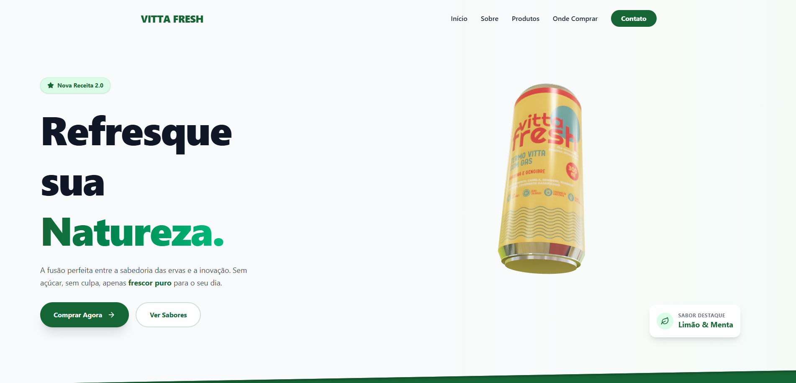

# 🍃 Vitta Fresh | Experiência Digital 3D

> Uma Landing Page imersiva para a marca de bebidas naturais Vitta Fresh, apresentando produtos com interatividade 3D em tempo real.


---

## 🖼️ Preview do Projeto

> 

## 🚀 Sobre o Projeto

Este projeto é uma aplicação web moderna desenvolvida para simular o site institucional da **Vitta Fresh**. O objetivo principal é demonstrar habilidades em **Front-end Avançado**, unindo design responsivo com elementos 3D interativos.

A aplicação permite que o usuário interaja com o produto (uma lata de refrigerante 3D), explorando o rótulo em 360 graus diretamente no navegador.

### ✨ Funcionalidades Principais

* **Visualização 3D Interativa:** Renderização de modelo 3D usando **React Three Fiber** com controles de órbita.
* **Animações Fluidas:** Transições de página e elementos de UI animados com **Framer Motion**.
* **Design Responsivo:** Layout totalmente adaptável para Mobile e Desktop utilizando **Tailwind CSS**.
* **Roteamento Otimizado:** Navegação SPA (Single Page Application) com **React Router DOM** e carregamento preguiçoso (Lazy Loading) para performance.
* **UI Moderna:** Componentes estilizados e ícones vetoriais via **Lucide React**.

---

## 🛠️ Tecnologias Utilizadas

O projeto foi desenvolvido utilizando as seguintes tecnologias:

* **[React](https://reactjs.org/)** - Biblioteca principal para construção da UI.
* **[Vite](https://vitejs.dev/)** - Build tool ultrarrápida.
* **[React Three Fiber](https://docs.pmnd.rs/react-three-fiber)** - Renderizador React para Three.js (Experiência 3D).
* **[Tailwind CSS](https://tailwindcss.com/)** - Framework de utilitários CSS para estilização ágil.
* **[Framer Motion](https://www.framer.com/motion/)** - Biblioteca de animações para React.
* **[React Router Dom](https://reactrouter.com/)** - Gerenciamento de rotas.
* **[Lucide React](https://lucide.dev/)** - Biblioteca de ícones leve e consistente.

---

## 💻 Como Rodar o Projeto

Pré-requisitos: Você precisa ter o [Node.js](https://nodejs.org/) instalado em sua máquina.

### 1. Clone o repositório

```bash
git clone [https://github.com/seu-usuario/vittafresh-3d.git](https://github.com/seu-usuario/vittafresh-3d.git)
cd vittafresh-3d
```

### 2. Instale as dependências

```bash
npm install
```

### 3. Inicie o servidor de desenvolvimento

```bash
npm run dev
```

O projeto estará rodando em `http://localhost:5173`.

---

## 📂 Estrutura de Pastas

```bash
src/
├── assets/         # Imagens estáticas e svgs
├── components/     # Componentes reutilizáveis (Navbar, Footer, etc)
├── pages/          # Páginas da aplicação (Home, About, Products...)
├── App.jsx         # Configuração principal de rotas e layout
├── main.jsx        # Ponto de entrada da aplicação
└── index.css       # Estilos globais e diretivas do Tailwind
```

---

## 🎨 Melhorias Futuras

* [ ] Adicionar mais modelos 3D para diferentes sabores.
* [ ] Implementar modo escuro (Dark Mode).
* [ ] Otimizar texturas do modelo 3D para conexões lentas.
* [ ] Adicionar testes unitários com Vitest.

---

## 📝 Licença

Este projeto está sob a licença MIT. Veja o arquivo [LICENSE](LICENSE) para mais detalhes.

---

Desenvolvido com 💚 por **Davi Passos**
[LinkedIn](https://www.linkedin.com/in/davi_psss) | [GitHub](https://github.com/Da6-dev)